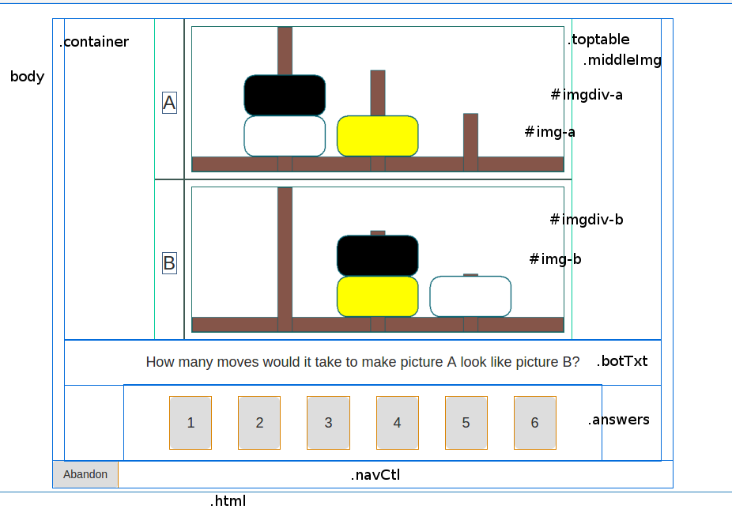

# Hoops Quiz : structure, technology and algorithms

* representation of the 
s in the page, description of the purpose of each.
* image dimensions
* names of any included libraries (e.g. node.js)
* description with pseudo-code of scaling algorithm based around the method I outlined - i.e. determine separately the scaling in each of the horizontal and vertical directions required to fit the window, then resize using the smaller of these factors as a parameter.
* Worked numeric examples for screen resolutions of (HxV) 1280x1024, 640x480, 320x480, 750x1334 and 1242x2208

\newpage

## Description of page elements

>representation of the HTML elements in the hoops puzzle, with a description of the purpose of each.
                            
    body                    HTML <body> tag
    div.container           Added by Yeoman/Bootstrap to add page margins. Possibly not needed.
    div#pages               A container for the pages, one of which is shown at a time
	div.page#game           A page div for the main puzzle
	div.toptable-container  A container for the image table. Possibly not needed
	table.toptable          Table containing cells containing the two images for each puzzle
	td#imgdiv-a             Containing cell for the upper image
    img#img-a               The upper image, which is the same on each page
	td#imgdiv-b             Containing cell for the lower image
    img#img-b               The lower image, which is different on each page
	div.botTxt              Holds the explanatory text when required
	div.answers             Holds the buttons 1-6 for the user to answer the puzzle, as required
	div.navCtl              Holds the "Prev/Next" navigation buttons in the intro, as needed

## Image Dimensions

The images are all PNG format, 8-bit/color RGBA, non-interlaced.
There are five images, one for each page, in the introduction: `intro1.png` to `intro5.png`. They have the dimensions 748px x 470px.
Apart from the intro screens, the other images are 748px x 291px, two on each screen, one at the top, one at the bottom.

The image at the top remains constant (this is different from the original test, where the bottom image remains constant). Its name is `top-constant.png`

The other images change on each page in a psuedo-random fashion. I have name them in the format:

    t3<x>2<y>1<z>.png

where:

`t` stands for tile
3 is the leftmost peg, which can hold 3 hoops
`<x>` is a sequence of letters describing which hoops are on the peg denoted by the preceding number, from top to bottom, using the letters `y`, `b` and `w` for Yellow, Black and White, respectively.
2 is the middle peg, which can hold 2 hoops
`<y>` is the sequence of hoops from top to bottom on the middle peg
1 is the rightmost peg, which can hold 1 hoop
`<z>` is the sequence of hoops from top to bottom on the rightmost peg

Thus, we have the images:

    t32by1w.png, t32wy1b.png, t3bw21y.png, t3w2b1y.png, t3w2yb1.png, t3wb2y1.png, t3wy2b1.png, t3y2b1w.png, t3yb21w.png, t3ybw21.png, t3yw21b.png, t3yw2b1.png, t3ywb21.png

## List of Libraries

>names of any included libraries (e.g. node.js)

    jquery.js
    jquery-ui.css
    modernizr.js
    browser-sync.js
    bootstrap.css
    bootstrap-sass

The build system was created by yeoman running on node.js via npm. It uses the gulp task runner to perform SASS compilation, testing, linting, synchronised browsing, minification, and front-end package management via bower. The CSS framework is Bootstrap, though I have overridden a lot of it to make things simpler. The code in main.js uses jQuery.

    http://yeoman.io/
    https://nodejs.org/
    https://www.npmjs.com
    http://gulpjs.com
    http://sass-lang.com/
    https://bower.io/
    http://getbootstrap.com/
    https://jquery.com/

## Description of Scaling Algorithm

>description with pseudo-code of scaling algorithm based around the method I outlined - i.e. determine separately the scaling in each of the horizontal and vertical directions required to fit the window, then resize using the smaller of these factors as a parameter.

## Worked Examples

>Worked numeric examples for screen resolutions of (HxV) 1280x1024, 640x480, 320x480, 750x1334 and 1242x2208

## Appendix

    2016-07-31 01:08:01 kvogel@yoga3-vlubuntu ~/Projects/bb-quizzes/hoops/yo/app/images
    $ file *
    intro1.png:       PNG image data, 748 x 470, 8-bit/color RGBA, non-interlaced
    intro2.png:       PNG image data, 748 x 470, 8-bit/color RGBA, non-interlaced
    intro3.png:       PNG image data, 748 x 470, 8-bit/color RGBA, non-interlaced
    intro4.png:       PNG image data, 748 x 644, 8-bit/color RGBA, non-interlaced
    intro5-orig.png:  PNG image data, 748 x 723, 8-bit/color RGBA, non-interlaced
    intro5.png:       PNG image data, 748 x 487, 8-bit/color RGBA, non-interlaced
    t32by1w.png:      PNG image data, 748 x 291, 8-bit/color RGBA, non-interlaced
    t32wy1b.png:      PNG image data, 748 x 291, 8-bit/color RGBA, non-interlaced
    t3bw21y.png:      PNG image data, 748 x 291, 8-bit/color RGBA, non-interlaced
    t3w2b1y.png:      PNG image data, 748 x 291, 8-bit/color RGBA, non-interlaced
    t3w2yb1.png:      PNG image data, 748 x 291, 8-bit/color RGBA, non-interlaced
    t3wb2y1.png:      PNG image data, 748 x 291, 8-bit/color RGBA, non-interlaced
    t3wy2b1.png:      PNG image data, 748 x 291, 8-bit/color RGBA, non-interlaced
    t3y2b1w.png:      PNG image data, 748 x 291, 8-bit/color RGBA, non-interlaced
    t3yb21w.png:      PNG image data, 748 x 291, 8-bit/color RGBA, non-interlaced
    t3ybw21.png:      PNG image data, 748 x 291, 8-bit/color RGBA, non-interlaced
    t3yw21b.png:      PNG image data, 748 x 291, 8-bit/color RGBA, non-interlaced
    t3yw2b1.png:      PNG image data, 748 x 291, 8-bit/color RGBA, non-interlaced
    t3ywb21.png:      PNG image data, 748 x 291, 8-bit/color RGBA, non-interlaced
    top-constant.png: PNG image data, 748 x 291, 8-bit/color RGBA, non-interlaced
