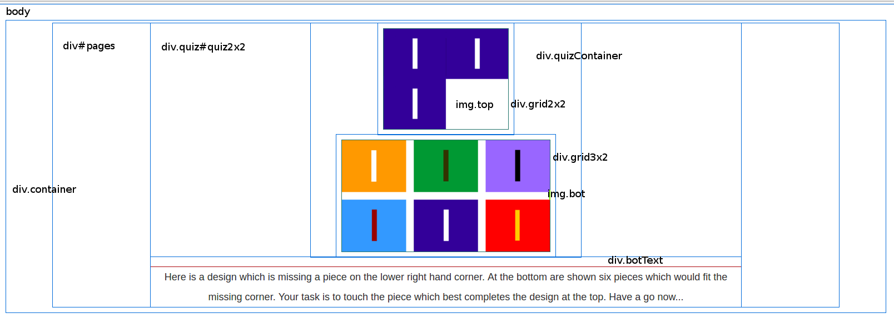

# Matrix Quiz : structure, technology and algorithms

A document describing the structure, technology and sizing algorithms in the main web-page of the Matrices questionnaire.

## Contents

* A pictorial representation of the `<div>`s in the page, accompanied by a brief description of the purpose of each.
* Image dimensions
* A description of the algorithm used to determine the scaling of the image elements
* Worked numeric examples for various screen resolutions
* Included libraries

\newpage
\pagebreak

## Layout


  
    body                HTML <body> tag
    div.container       Used to add margins around the content
    div#pages           A container for the pages, one of which is shown at a time
    div#quiz2x2.quiz    A page div, the 2x2 quiz is shown in this example
    div.gridContainer   Used to keep grids together and scaled relative to each other, and to centre using left and right margins
    .grid2x2            Contains the top grid image
    .grid3x2            Contains the bottom grid image, and padding to distance it from the top grid
    img.top             The top grid image, which is changed by main.js
    img.bot             The bottom grid image, which is changed by main.js
    div.botText         Holds the explanatory text when required

\newpage

### natural image sizes

    2x2, 3x2
    img.top natural: 420 x 340
    img.bot natural: 680 x 365

    3x3, 4x2
    img.top natural: 510 x 405
    img.bot natural: 755 x 295

### width (symmetrical about y axis)

    html                -
    body                -
    div.container       10px
    div#pages           -
    div#quiz2x2.quiz    -
    div.gridContainer   margins set by calc
    div.grid3x2         margin: auto, width: 81% e.g. 65.1px
    img.bot (natural)   680px (quiz2x2) | 755px (quiz3x3)
    div.grid3x2         margin: auto, width: 81% e.g. 65.1px
    div.gridContainer   margins set by calc
    div#quiz2x2.quiz    -
    div#pages           -  
    div.container       10px
    body                -
    html                -


widthExtra = (div.container + div.gridContainer + div.grid3x2 margin) * 2 + img.bot
widthNatural


notes:

* div.container padding: 15px 10px 20px 10px; (N, E, S, W)
* div#pages has margin: auto but always fills div.container
* hard-code natural image sizes - see "Can we get the native/natural height of images?"

### height

    html                -
    body                -
    #devBar             hidden
    div.container       padding-top: 15px
    div#pages           -
    div#quiz2x2.quiz    -
    div.gridContainer   -
    img.top (natural)   340px (quiz2x2) | 405px (quiz3x3)
    div.grid3x2         padding-top: 5% e.g. 34px
    img.bot (natural)   365px (quiz2x2) | 295px (quiz3x3)
    div.gridContainer   -
    div.botText         72px minimum (if not wrapped) (if visible)
    div#quiz2x2.quiz    -
    div#pages           -
    div#abandon-div     34px (if visible)
    div.container       padding-bottom: 20px
    body                -
    html                -

\newpage

## Details of image sizes

### 2x2 Puzzle


* The top image is 420px x 340px, 2 tiles wide by 2 tiles high
* Each tile is 210px x 170px, with no space between them


* The bottom image is 680px x 365px, 3 tiles wide x 2 tiles high
* Each tile is 210px x 170px and there is a gap of 25px between each tile, horizontally and vertically.

# 3x3 Puzzle


* The top image is 510px x 405px, 3 tiles wide by 3 tiles high
* Each tile is 170px x 135px, with no space between them

* The bottom image is 755px x 295px, 4 tiles wide x 2 tiles high
* Each tile is 170px x 135px and there is a gap of 25px between each tile, horizontally and vertically.


\newpage

## Description Of Scaling Algorithm

### scaleImagesCBsimple()

    setMargins = ($(window).width() - ($(window).height() - heightExtra) - widthExtra) / 2;

* Tries to keep the `div.gridContainer` element square by setting the margins of `.gridContainer`
* The abandon button scrolls off the bottom at extreme width and short height.

### New Scaling Algorithm

#### Pseudo-code

```
    get natural width/height (naturalFullWidth/Height)
    get window width/height ($(window).width()/height)

    # allow 200px for text at bottom
    # window - 200px height needs to fit natural width/height

    vertical shrink = (window height - 200px) / naturalFullHeight
    horizontal shrink = window width / naturalFullWidth

    scale = vShrink < hShrink ? vShrink : hShrink

    targetHeight = naturalFullHeight * scale
    targetWidth = naturalFullWidth * scale # forget about width as width always fits, down to 300px

    targetMiddleHeight = targetHeight - heightExtras

    # need h/w ratio of .gridContainer
    # Typical dimensions: 162 x 144
    # 162 / 144 == 1.125
    middleHWRatio = 1.125

    # what innerWidth of .gridContainer would create targetMiddleHeight?
    targetMiddleWidth = targetMiddleHeight * middleHWRatio [1.125]

    # set these margins on .gridContainer to make the targetWidth and targetHeight
    margins = (window.width - widthExtra) / 2
```

#### JavaScript code

    # get the margin widths
    margins =   ($('.container').outerWidth(true) - $('.container').width()) + 
                ($('#pages').outerWidth(true) - $('#pages').width())

    #  subtract from the viewport width – height, divide by 2 for left and right margins
    setMargin = ($(window).width() - ($(window).height() - $('.botText').height()) - margins) / 2

    if (setMargin > 0):
        $('.gridContainer').css('margin-left', setMargin) # set the margins to (screen width - height) / 2
        $('.gridContainer').css('margin-right', setMargin)
    else:
        $('.gridContainer').css('margin-left', 0)  # set the margins to (screen width - height) / 2
        $('.gridContainer').css('margin-right', 0)


### Can we get the native/natural height of images in JavaScript?

In order to work out the natural, unscaled dimensions of the content, in order to scale them to fit the viewport, we need to know the original dimensions of the images. Could we do this programmatically? 

This is slighty tricky: there are native javascript attributes: `.naturalWidth` / `.naturalHeight` but for IE, in **IE9+**

    var width = $(this).get(0).naturalWidth; var height = $(this).get(0).naturalHeight; // current element
    var width = $("selector").get(0).naturalWidth; var height = $("selector").get(0).naturalHeight; // selected element

There is a plugin that adds `.naturalHeight()` and `.naturalWidth()` to jQuery.
Workaround for IE6-IE8: create a `new Image()` element, and get the width and height of that.
As we know the image dimensions and they are not going to change, we might as well hard-code them.

\newpage

## Worked examples

Worked numeric examples for screen resolutions of (HxV) 1280x1024, 640x480, 320x480, 750x1334 and 1242x2208.

1308 x 598:

    margins = ($('.container').outerWidth(true)[1308] - $('.container').width())[1278]
    * ($('#pages').outerWidth(true)[1278] - $('#pages').width()[1278]) == 30

    setMargin = ($(window).width()[1308] - ($(window).height()[598] - $('.botText').height()[-18]) - margins[30]) / 2 == 331

1280x1024

640x480

320x480

750x1334

1242x2208

\newpage

## List of included libraries

    jquery.js
    jquery-ui.css
    modernizr.js
    browser-sync.js
    bootstrap.css
    bootstrap-sass
    imageMapResizer.js

The build system was created by yeoman running on node.js via npm. It uses the gulp task runner to perform SASS compilation, testing, linting, synchronised browsing, minification, and front-end package management via bower.

The CSS framework is Bootstrap, though I have overridden a lot of it to make things simpler.
The code in main.js uses jQuery.

    http://yeoman.io/
    https://nodejs.org/
    https://www.npmjs.com
    http://gulpjs.com
    http://sass-lang.com/
    https://bower.io/
    http://getbootstrap.com/
    https://github.com/davidjbradshaw/image-map-resizer
    https://jquery.com/

\newpage

## Appendix

images/intro1/intro1-sol5.png:     PNG image data, 420 x 340, 8-bit/color RGBA, non-interlaced
images/intro1/intro1-palette.png:  PNG image data, 680 x 365, 8-bit/color RGBA, non-interlaced

images/ex5/ex5-sol2.png:           PNG image data, 420 x 340, 8-bit/color RGBA, non-interlaced
images/ex5/ex5-palette.png:        PNG image data, 680 x 365, 8-bit/color RGBA, non-interlaced

images/ex7/ex7-sol1.png:           PNG image data, 510 x 405, 8-bit/color RGBA, non-interlaced
images/ex7/ex7-palette.png:        PNG image data, 755 x 295, 8-bit/color RGBA, non-interlaced

images/ex13/ex13-sol4.png:         PNG image data, 511 x 411, 8-bit colormap, non-interlaced
images/ex13/ex13-palette.png:      PNG image data, 755 x 295, 8-bit/color RGBA, non-interlaced

images/ex14/ex14-sol6.png:         PNG image data, 307 x 302, 8-bit colormap, non-interlaced
images/ex14/ex14-palette.png:      PNG image data, 755 x 295, 8-bit/color RGBA, non-interlaced
the one with the coloured squares - top and bottom are clearly different sizes

images/ex15/ex15-sol6.png:         PNG image data, 534 x 422, 8-bit colormap, non-interlaced
images/ex15/ex15-palette.png:      PNG image data, 755 x 295, 8-bit/color RGBA, non-interlaced

but all palette images overlayed with imagemaps are consistent
and differences in top images not really noticeable