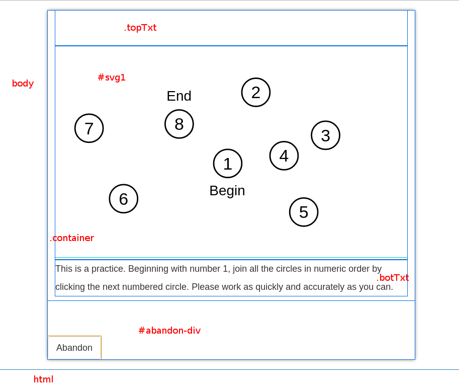

# Trails Quiz : structure, technology and algorithms

## Contents

* Representation of the elements in the page, description of the purpose of each.
* Image dimensions
* Description of scaling algorithm
* Worked numeric examples for screen resolutions of (HxV) 1280x1024, 640x480, 320x480, 750x1334 and 1242x2208
* Names of any included libraries

\newpage

## Description of page elements



>representation of the HTML elements in the trails puzzle, with a description of the purpose of each.

    body                    HTML <body> tag
    #devBar                 hidden    
    div.container           Used to add page margins
    div#pages               Container to switch the pages
    div.page#game           Container for the main puzzle
    div#puzzle              Container for puzzle image
    div.botTxt              Holds the explanatory text when required
    div.answers             Holds the buttons 1-6, as required
    div.navCtl              Holds the "Prev/Next" buttons, as needed

### Element heights (top to bottom)

    html                -
    body                -
    #devBar             hidden
    div.container       padding-top: 15px
    div#pages           -
    div#game            -
    div#puzzle          ?
    div.botText         72px minimum (if not wrapped) (if visible)
    div#answers         -
    div.navCtl          
    div#pages           -
    div#abandon-div     34px (if visible)
    div.container       padding-bottom: 20px
    body                -
    html                -

\newpage

## Image details

The original online trails quiz was made with raster images of parts of the puzzle initially hidden and then shown using JavaScript when specific `<area>`s in an HTML `<map>` are clicked. This approach worked well enough when the screen was big enough to display the fixed dimensions of the image (?), but did not scale to smaller screen sizes (?).

For this rewrite, I decided to use Scalable Vector Graphics (SVG). Basic SVG features used in this application are [well supported by current browsers](http://caniuse.com/#feat=svg) and have been supported since IE6, Chrome 4, Firefox 2, Opera 10, Safari 3.1, Android Browser 2.1, iOS Safari 3.1. For any browsers that don't support SVG, there is a polyfill called [HTML5Shim](https://github.com/aFarkas/html5shiv), originally known as [HTML5Shiv](http://stackoverflow.com/questions/14429061/html5-shim-vs-shiv).

SVG images can be displayed inline in HTML, or embedded using the `<embed>` or `<object>` tag. As the game, like the others, is effectively a single-page application - there is only one HTML file - I decided to embed each SVG within the HTML at runtime - to avoid having the SVG for all four puzzles (two live ones and two practice runs) inlined in the same HTML file, which would drastically increase page load time, as well as being difficult to manage.

When an SVG is embedded, it creates its own DOM in the browser - a "shadow DOM". This means that elements of that shadow DOM are not immediately accessible to the main DOM like other page elements are.

In order to access the inner DOM, we need some code like this:

```js
    var svg1 = document.getElementById('svg1');         // select our SVG:  <object id="svg1" type="image/svg+xml" data=""></object>
    svg1.addEventListener('load', function () {         // will be invoked each time svg loaded
        var svgDoc = svg1.contentDocument;              // get inner DOM of svg
        ...                                             // do stuff with svgDoc
    });
```

We need to wait until the SVG has loaded before acting upon it, so a function callback is added to the `onload` event of the SVG. Note that the anonymous function callback is therefore a closure, and has access to the enclosing scope, i.e. it can access `svg1` even though it will be invoked at some point after it is declared.

Then we can add event listeners to sub-elements of the SVG:

```js
    var group = svgDoc.getElementById(id);                  // get inner element by id
    group.addEventListener('mousedown', correct, false);    // where correct() is a function
```

As the game progresses, and clicking on some elements (circles) becomes correct and others incorrect, these event listeners can be changed in a similar way:

```js
    var svgDoc = document.getElementById('svg1').contentDocument; 
    var oldGroup = svgDoc.getElementById(oldId);            // the correct element that has been clicked on
    oldGroup.removeEventListener('mousedown', correct);     // no longer correct or wrong
    var newGroup = svgDoc.getElementById(newId);            // the next correct element to click on
    newGroup.removeEventListener('mousedown', wrong);       // no longer wrong
    newGroup.addEventListener('mousedown', correct);        // clicking on this element now invokes correct()
```

### circles, text, groups and lines

The puzzles in the Trails game are comprised of groups of circles and text connected by lines. Luckily, the SVG spec provides tags for these image elements:

```html
    <line id="l1" x1="277" y1="390" x2="213" y2="452" stroke-width="2" stroke="black" display="none" />
    <g id="g1">
        <circle id="c1" cx="277" cy="390" r="20" alt="circle1" stroke-width="2" stroke="black" fill="white" />
        <text  x="277" y="390" text-anchor="middle" dominant-baseline="central">1</text>
    </g>
```

Each `<circle>` has a `<text>` object centred within it. These are siblings - rather than parent and child, where one would obscure the other. But in order for the circle/text combination to respond to clicks as one unit, they must be grouped together. This is where the `<g>` element comes in. The event listeners are attached to the `<g>` elements, and receive events (e.g. mouse clicks) on any of the child elements. This is known as *event bubbling*. If not caught by an event listener, the events would bubble up right to the top element of the DOM - which, in this case, is `<svg>`, not `<html>`, as our SVG embedded within the HTML and not inlined.

### The Viewbox

The `<svg>` tag demands a `viewbox` attribute to be set: given the coordinates of the elements it comprises, what rectangular section of it should be visible? Usually, this will allow the whole image to visible:

```html
<svg version="1.1" xmlns="http://www.w3.org/2000/svg" width="100%" viewBox="0 0 600 600">
```

### Preventing selection

When attempting the puzzle with a mouse, or similar device that allows click-and-drag selection (i.e. not finger touches on a mobile), it was quite easy to accidentally select the `<text>` element grouped with a `<circle>` when clicking it. A bit of CSS fixes this:

```css
* {
    -webkit-touch-callout: none;
    -webkit-user-select: none;
    -khtml-user-select: none;
    -moz-user-select: none;
    -ms-user-select: none;
    user-select: none;
    font-family: Verdana, Arial, Helvetica, sans-serif;   
}
```

The `font-family` declaration prefers non-serif fonts which are easier to read.

\newpage

## Explanation of data collected

For each game, these values are recorded:
 
* `sesh_id` is the session ID
* `ntests` is the number of puzzles completed (?)
* `tinstruct` is the time the instructions were shown to the user
* `tstart` is the time the quiz was started (one for each puzzle?)
* `tfinish` is the time the quiz was finished (one for each?)
* `tinsert` is the time the row was inserted into the database
* `responses` is the responses from quiz - a blob of JSON data to be parsed by backend

For each circle in each test (practice and real), three values are collected:

* wrong` is the number of wrong clicks before correct one.
* time` is the time taken to click correct next circle since start of puzzle, in deci-seconds, capped at 32000.
* total` is the total time elapsed since start of whole game, in deci-seconds, capped at 32000.

The user has 2 minutes for each practice and each real test. 
If the time limit is reached, the "thanks" screen is displayed, results, are posted back to the server and the game ends. (??)


### Bunched events in Internet Explorer

Even latest versions of Internet Explorer (currently 11) will "bunch" events if the CPU or memory load is high. That is, user events such as mouse clicks may not be handled at the time that they happened, and instead, a series of delayed events will occur at practically the same time. 

In this case, the **most recent**, rather than the longest outstanding event, will then be triggered. This caused some negative time deltas in the Healthy Minds quiz - i.e. subsequent events appeared to have happened before each other. This happened in a small number of cases (e.g. 7 in 10,0000) in testing. No workaround was found.

In the case of the trails quiz, there are two potential issues:

1) Delta times could be wrong
2) Events could trigger in the wrong order and put the application in an unintended state - e.g. it might cease to function in the correct manner.

Regarding these two points:

1) The potential timing errors were in the range >10 milliseconds, and the precision of the timings gathered is deciseconds, and not critical - the aggregate data is what is required
2) i) The potential time error should be much less than a human is able to generate clicks on separate (circle) elements. Therefore it should not be possible for click events to be handled in the wrong order.
   ii) Even if it were possible for the events to be handled in the wrong order, it should not put the application in an unstable state - a correct click might be interpreted as a wrong one or vice versa - but the application should be able to handle that anyway and the impact to the user and to the timings would be minor.

[hasperformance?]


## Description of Scaling Algorithm

[TODO]

#### Pseudo-code for scaling algorithm

[TODO]

#### JavaScript code for scaling algorithm

[TODO]

\newpage

## Worked Examples

>Worked numeric examples for screen resolutions of (HxV) 1280x1024, 640x480, 320x480, 750x1334 and 1242x2208

### 1280x1024


### 640x480


### 320x480


### 750x1334


### 1242x2208


\newpage

## List of Libraries

>names of any included libraries (e.g. node.js)

    jquery.js
    jquery-ui.css
    modernizr.js
    browser-sync.js
    bootstrap.css
    bootstrap-sass

The build system was created by yeoman running on node.js via npm. It uses the gulp task runner to perform SASS compilation, testing, linting, synchronised browsing, minification, and front-end package management via bower. The CSS framework is Bootstrap, though I have overridden a lot of it to make things simpler. The code in main.js uses jQuery.

    http://yeoman.io/
    https://nodejs.org/
    https://www.npmjs.com
    http://gulpjs.com
    http://sass-lang.com/
    https://bower.io/
    http://getbootstrap.com/
    https://jquery.com/

\newpage

## Database table for trails Quiz

All data for a user's session is stored in on row in the table `trails`.

There is "header" information:

    sesh_id     Session ID
    ntests      Number of puzzles completed
    tinstruct   Time the instructions were shown to the user
    tstart      Time the quiz was started
    tfinish     Time the quiz was finished
    tinsert     Time the row was inserted into the database (default 'now')
    responses   JSON blob returned at end of quiz, to be parsed by backend

Then, for each click on each circle of each test, 3 values in the format:

    zz_x_wrong  Number of wrong clicks before correct one
    zz_x_time   Time taken to click correct next circle since start of puzzle
    zz_x_total  Total time elapsed since start of whole game

where zz is the puzzle: 

    ap          part a, practice
    ar          part a, real
    bp          part b, practice
    br          part b, real

and x is the sequential number of the element (circle) clicked.

    (Table) cp.trails
    Comment:None
    Journaled:No
    Page Size:8K Pages:3 Overflow Pages:None
    Structure:HEAP
    Compression:None
    Key Field   Type            Null    Default Comment
    sesh_id     INTEGER4        No      None    Session ID
    ntests      INTEGER4        No      None    Number of puzzles completed
    tinstruct   INGRESDATE      No      None    Time the instructions were shown to the user
    tstart      INGRESDATE      No      None    Time the quiz was started
    tfinish     INGRESDATE      No      None    Time the quiz was finished
    tinsert     INGRESDATE      No      'now'   Time the row was inserted into the database (default 'now')
    responses   LONG VARCHAR    No      None    JSON returned at end of quiz, to be parsed by backend
    ap_1_wrong  INTEGER2        No      None    Number of wrong clicks before correct one
    ap_1_time   INTEGER2        No      None    Time taken to click correct next circle since start of puzzle
    ap_1_total  INTEGER1        No      None    Total time elapsed since start of whole game
    ...
    ap_8_wrong  INTEGER2        No      None    
    ap_8_time   INTEGER2        No      None    
    ap_8_total  INTEGER1        No      None    
    ar_1_wrong  INTEGER2        No      None    
    ar_1_time   INTEGER2        No      None    
    ar_1_total  INTEGER1        No      None    
    ...
    ar_25_wrong INTEGER2        No      None    
    ar_25_time  INTEGER2        No      None    
    ar_25_total INTEGER1        No      None    
    bp_1_wrong  INTEGER2        No      None    
    bp_1_time   INTEGER2        No      None    
    bp_1_total  INTEGER1        No      None    
    ...
    bp_8_wrong  INTEGER2        No      None    
    bp_8_time   INTEGER2        No      None    
    bp_8_total  INTEGER1        No      None    
    br_1_wrong  INTEGER2        No      None    
    br_1_time   INTEGER2        No      None    
    br_1_total  INTEGER1        No      None    
    ...
    br_25_wrong INTEGER2        No      None    
    br_25_time  INTEGER2        No      None    
    br_25_total INTEGER1        No      None
    Secondary Indices:None
    Constraints:None
    Rules:None
    Grants:None

\newpage

## Appendix

